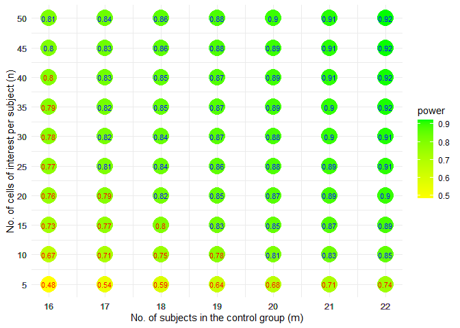

scPS
================
Chih-Yuan Hsu

Sept. 08, 2023

# Introduction to scPS

- Step 1: Estimation for prior parameters (estPreParas)
- Step 2: Power and Sample size calculation (sizeCal and powerCal)

## Step 1: Estimation for prior parameters

Suppose we have a pilot dataset: 1000 genes and 1760 cells (the cell
type of interest) from 44 subjects, where each of the two group has 22
subjects.

``` r
head(cell.info) ## cell information
```

    ##   id x1
    ## 1  1  0
    ## 2  1  0
    ## 3  1  0
    ## 4  1  0
    ## 5  1  0
    ## 6  1  0

``` r
head(counts[,1:10]) ## count matrix
```

    ##      [,1] [,2] [,3] [,4] [,5] [,6] [,7] [,8] [,9] [,10]
    ## [1,]    1    1    0    4    3    0    3    0    0     2
    ## [2,]    0    0    0    0    0    0    0    0    1     0
    ## [3,]    3    2    6    2    6    0    6    7    6     5
    ## [4,]    4    4    1    0    3    8    1    5    1     1
    ## [5,]    0    0    0    3    1    0    0    1    0     0
    ## [6,]    0    0    0    1    0    0    3    0    0     0

``` r
preParas <- estPreParas(counts, cell.info)
head(preParas)
```

    ##         icc   means1    means2    vars1    vars2 nonZeroPs1 nonZeroPs2
    ## 1 0.2978916 3.326136  6.782955 35.75813 107.7651  0.5443182  0.7284091
    ## 2 0.1977988 2.765909 10.432955 18.06346 202.2685  0.6159091  0.7920455
    ## 3 0.2657919 2.953409  7.271591 19.83287 125.9887  0.6386364  0.7511364
    ## 4 0.2380345 2.500000  9.634091 15.06940 199.9911  0.6045455  0.7647727
    ## 5 0.2340566 2.755682  9.984091 17.03125 216.2250  0.6295455  0.7772727
    ## 6 0.1906619 3.226136  9.440909 19.71786 155.0955  0.6772727  0.8170455


## Step 2: Power and Sample size calculation

Assume that 300 genes will be tested and 50 genes are differentially
expressed genes.

### Sample size calculation

``` r
vvmean1 <- preParas$means1
FC <- rep(1, length(vvmean1))
FC[1:50] <- preParas$means2[1:50]/preParas$means1[1:50]
vvrho <- preParas$icc

size.view <- sizeCal2(low.up.m=c(16,22), low.up.n=c(5,50), ePower=0.8, FDR=0.05,
         grid.m=1, grid.n=5, r=1, total=NULL,
         vvmean1=vvmean1[1:1000], FC=FC[1:1000], vvrho=vvrho[1:1000], hf=hf)
```

<!-- -->

### Power calculation while controlling FDR

``` r
powerCal(n=40, ms=c(1,1)*22,
         vvmean1=vvmean1[1:1000], FC=FC[1:1000], vvrho=vvrho[1:1000], hf=hf, FDR=0.05)
```

    ##       power       alpha 
    ## 0.918838666 0.002545254
