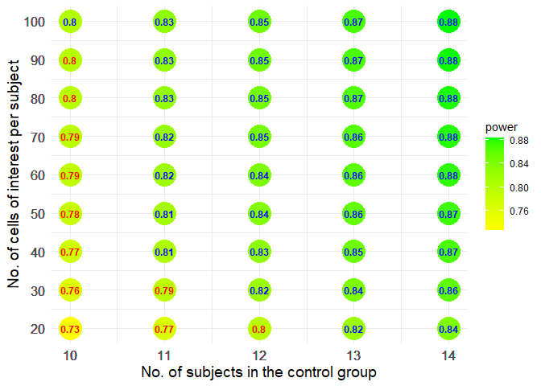
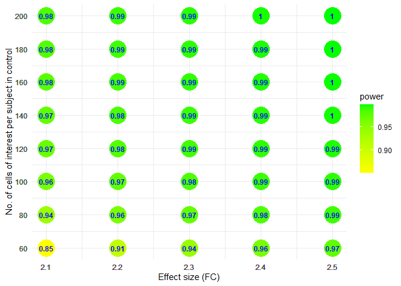
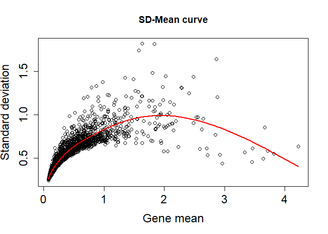
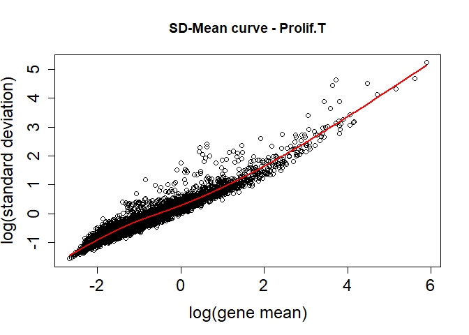
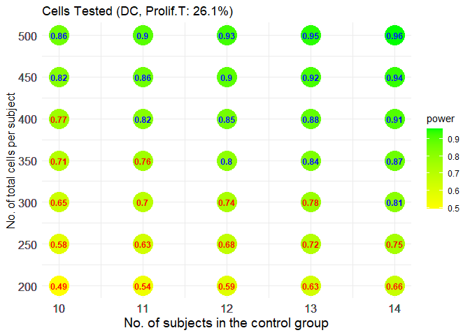
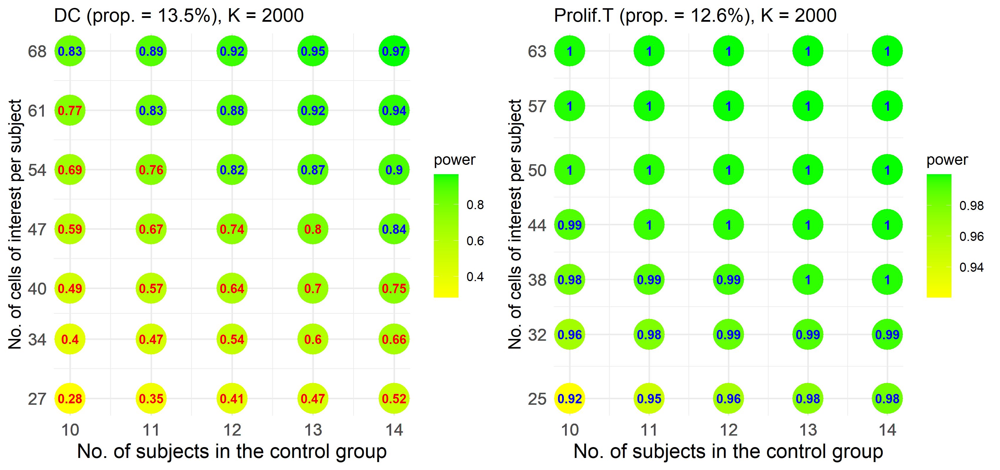

Comparison between two independent groups
================

``` r
library(scPS)
library(ggplot2)
```

- Example 1. With a fixed fold change (effect size)
- Example 2. With a fixed sample size
- Example 3. With a pilot data

### Example 1

#### A simulated information (without data)

``` r
set.seed(12345)
# Provide gene means for 1000 candidate genes in control
# Gene means can be fitted with a gamma distribution, 
# according to real data. The shape and scale parameters in gamma can be
# calculated by gammaTrans when given the mean and the 0.95 quantile of gene means.
abm <- gammaTrans(mean=1, q95=3)
vvmean1 <- rgamma(1000, shape=abm[1], scale=abm[2])

# 2-fold change (experiment to control) in 5% DEGs
FC <- c(rep(2, 50), rep(1, 950))

# Provide cell-cell correlations for 1000 candidate genes within subject
# Correlations can be fitted well with a gamma distribution, 
# according to real data. The shape and scale parameters in gamma can be
# calculated by gammaTrans when given the mean and the 0.95 quantile of ICCs.
ab <- gammaTrans(mean=0.01, q95=0.1) # Output the shape and scale parameters.
vvrho <- rgamma(1000, shape=ab[1], scale=ab[2])

# Relationship between gene standard deviations and gene means
# hf <- function(x) sqrt(x*(1+a*x)), a>1 denotes overdispersion
hf <- function(x) sqrt(x*(1+3*x))
```

#### Powers at different sample sizes and cell numbers per sample

At FDR = 0.05, expected power = 0.8 (marked in blue), 1:1 (r = 1)
allocation ratio, 1:1 (rc = 1) cells ratio (a ratio of cell numbers in
experiment to control).

``` r
view.size <- sizeCal(low.up.m=c(8,12), low.up.n=c(30,60), ePower=0.8, FDR=0.05,
                     grid.m=1, grid.n=5, r=1, rc=1, total=NULL, vvmean1, FC, vvrho, hf)
view.size$fig
```

<!-- -->

Show optimal m and n combination minimizing costs, given a cost
function:

``` r
head(optimalCost(view.size, costfun=function(m, n) m*n, ePower=0.8))
```

    ##    cost m1 m2 n1 n2     power
    ## 25 1200 12 12 50 50 0.8170643
    ## 33 1200 10 10 60 60 0.8021059
    ## 29 1210 11 11 55 55 0.8116169
    ## 30 1320 12 12 55 55 0.8292972
    ## 34 1320 11 11 60 60 0.8232441
    ## 35 1440 12 12 60 60 0.8381663

### Example 2

#### A hypothesized information

``` r
set.seed(12345)
# means of 2000 candidate genes in control
mean.control <- rep(1, 2000)

# 1% DEGs
n.DEG <- length(mean.control)*0.01

# cell-cell correlations for 2000 candidate genes within subject
ab <- gammaTrans(mean=0.01, q95=0.1) # Output the shape and scale parameters.
icc <- rgamma(2000, shape=ab[1], scale=ab[2])

# Relationship between gene standard deviations and gene means
hf <- function(x) sqrt(x*(1+3*x))
```

#### Powers at a fixed sample size but with different levels of FC

At FDR = 0.05, expected power = 0.8 (marked in blue), 1:1 (r = 1)
allocation ratio, 1:1 (rc = 1) cells ratio (a ratio of cell numbers in
experiment to control).

``` r
# Set different FC, 1.6, 1.7, ..., 2.0
# Fixed 8 subjects per group 
esizes <- seq(1.6, 2.0, 0.1)
list3 <- lapply(esizes, function(x) {
  FC <- c(rep(x, n.DEG), rep(1, length(mean.control) - n.DEG))
  size.view <- sizeCal(low.up.m=c(8,8), low.up.n=c(60,200), ePower=0.8, FDR=0.05,
                        grid.m=1, grid.n=20, r=1, rc=1, total=NULL,
                        vvmean1=mean.control, FC=FC, vvrho=icc, hf=hf)
  cbind(x=x, size.view$m.n.power)
})
dat2 <- do.call(rbind, list3); ePower <- 0.8
```

``` r
fig <- ggplot(dat2, aes(x=x, y=n, fill=power)) +
  geom_point(size=10, shape=21, colour = "transparent") +
  geom_text(aes(label = round(power, 2), color = ifelse(power > ePower, "blue", "red"), fontface=2),
            size = 3.2, show.legend = FALSE) +
  scale_color_manual(values = c("blue", "red")) +
  scale_fill_gradient(low = "yellow", high = "green") +
  scale_x_continuous(breaks = dat2$x) +
  scale_y_continuous(breaks = dat2$n) +
  xlab("Effect size (FC)") +
  ylab("No. of cells of interest per subject in control") +
  theme_minimal()
fig
```

<!-- -->

Gray points denote FDR cannot be controlled under a given level.

### Example 3

#### A pilot data that has been normalized by relative counts

``` r
counts <- COVID19n$counts
cell.info <- COVID19n$cell.info
```

#### Estimate required parameters from DC and Prolif.T cells of interest

Take 1 ~ 2 minutes

``` r
geneObject <- estPreParas.multi(counts, cell.info,
                     id="SampleId", x1="condition",
                     cells.interesting=c("T cells", "DC", "Prolif.T")[c(2,3)])
```

    ## [1] "Independent two-group comparison"

#### Select 2000 candidate genes for each cell type (DC and Prolif.T cells)

Take 1 ~ 2 minutes. For each cell type, 2000 genes with large observed
fold-changes are selected as candidate genes of interest and the top 1%
genes with the smallest unadjusted p-values among the candidate genes
are considered as DEGs.

``` r
Genes.tested <- geneCandidate(geneObject)
```

    ## [1] "Independent two-group comparison"

<!-- --><!-- -->

#### Total powers to detect the DEGs in the two cell types of interest

``` r
view.size <- sizeCal.multi(low.up.m=c(10,14), low.up.n=c(200,500),
     ePower=0.8, FDR=0.05, grid.m=1, grid.n=50, r=1, rc=1, total=NULL, Genes.tested)
view.size$fig
```

<!-- -->

#### Separate powers for each cell type of interest

``` r
#png("indep_10-1.png", width=3400, height=1600, res = 350)
plotPower.sep(view.size)
```

<!-- -->

``` r
#dev.off
```
