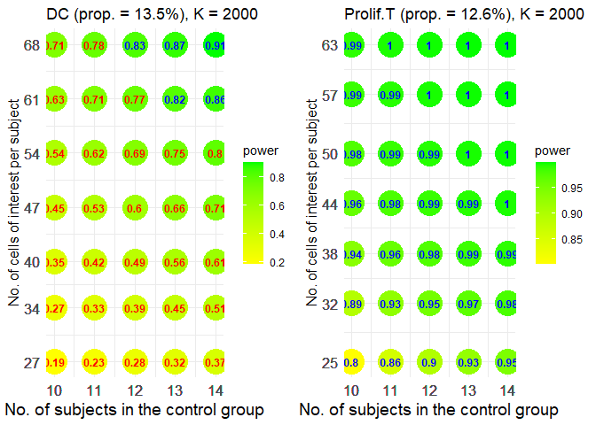

Comparison between two independent groups
================

``` r
library(scPS)
library(ggplot2)
```

- Example 1. With a fixed fold change (effect size)
- Example 2. With a fixed sample size
- Example 3. With a pilot data

### Example 1

#### A simulated information

``` r
set.seed(12345)
# means of 1000 candidate genes in control
vvmean1 <- rgamma(1000, shape=2, scale=0.5)

# 2-fold mean ratio (experiment to control) in 5% DEGs
MR <- c(rep(2, 50), rep(1, 950))

# cell-cell correlations for 1000 candidate genes within subject
vvrho <- runif(1000, 0, 0.2) 

# Relationship between gene standard deviations and gene means
# hf <- function(x) sqrt(a*x), a>1 denotes overdispersion
hf <- function(x) sqrt(x) 
```

#### Powers at different sample sizes and cell numbers per sample

At FDR = 0.05, expected power = 0.8 (marked in blue), 1:1 (r = 1)
allocation ratio.

``` r
view.size <- sizeCal(low.up.m=c(10,14), low.up.n=c(20,100), ePower=0.8, FDR=0.05,
        grid.m=1, grid.n=10, r=1, total=NULL, vvmean1, MR, vvrho, hf)
view.size$fig
```

<!-- -->

### Example 2

#### A hypothesized information

``` r
# means of 2000 candidate genes in control
mean.control <- rep(1, 2000)

# 1% DEGs
n.DEG <- length(mean.control)*0.01

# cell-cell correlations for 2000 candidate genes within subject
icc <- rep(0.01, length(mean.control))

# Relationship between gene standard deviations and gene means
hf <- function(x) sqrt(2*x)
```

#### Powers at a fixed sample size but with different levels of MR

At FDR = 0.05, expected power = 0.8 (marked in blue), 1:1 (r = 1)
allocation ratio.

``` r
# Set different MR, 2.1, 2.2, ..., 2.5
# Fixed 4 subjects per group 
esizes <- seq(2.1, 2.5, 0.1)
list3 <- lapply(esizes, function(x) {
  MR <- c(rep(x, n.DEG), rep(1, length(mean.control) - n.DEG))
  size.view <- sizeCal(low.up.m=c(4,4), low.up.n=c(100,300), ePower=0.8, FDR=0.05,
                        grid.m=1, grid.n=20, r=1, total=NULL,
                        vvmean1=mean.control, MR=MR, vvrho=icc, hf=hf)
  cbind(x=x, size.view$m.n.power)
})
dat2 <- do.call(rbind, list3); ePower <- 0.8
```

``` r
fig <- ggplot(dat2, aes(x=x, y=n, fill=power)) +
  geom_point(size=10, shape=21, colour = "transparent") +
  geom_text(aes(label = round(power, 2), color = ifelse(power > ePower, "blue", "red")),
            size = 3.2, show.legend = FALSE) +
  scale_color_manual(values = c("blue", "red")) +
  scale_fill_gradient(low = "yellow", high = "green") +
  scale_x_continuous(breaks = dat2$x) +
  scale_y_continuous(breaks = dat2$n) +
  xlab("Effect size (MR)") +
  ylab("No. of cells of interest per subject") +
  theme_minimal()
fig
```

<!-- -->

### Example 3

#### A pilot data that has been normalized by relative counts

``` r
counts <- COVID19n$counts
cell.info <- COVID19n$cell.info
```

#### Estimate required parameters from DC and Prolif.T cells of interest

Take 1 ~ 2 minutes

``` r
geneObject <- estPreParas.multi(counts, cell.info,
                     id="SampleId", x1="condition",
                     cells.interesting=c("T cells", "DC", "Prolif.T")[c(2,3)])
```

    ## [1] "Two independent group comparison"

#### Select 2000 candidate genes for each cell type (DC and Prolif.T cells)

Take 1 ~ 2 minutes. 2000 candidate genes are selected according to the
smallest unadjusted p-values.

``` r
Genes.tested <- geneCandidate(geneObject)
```

    ## [1] "Two independent group comparison"

<!-- --><!-- -->

#### Total powers to detect the DEGs in the two cell types of interest

``` r
view.size <- sizeCal.multi(low.up.m=c(10,14), low.up.n=c(200,500),
     ePower=0.8, FDR=0.05, grid.m=1, grid.n=50, r=1, total=NULL, Genes.tested)
view.size$fig
```

<!-- -->

#### Separate powers for each cell type of interest

``` r
#png("indep_10-1.png", width=3400, height=1600, res = 350)
plotPower.sep(view.size)
```

<!-- -->

``` r
#dev.off
```
