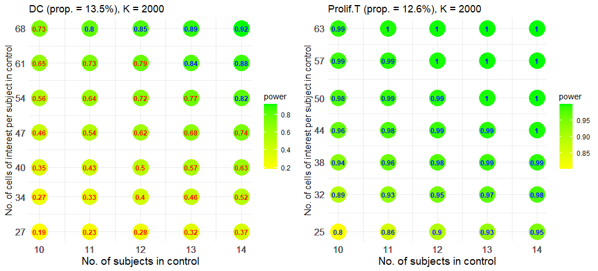

Independent Two-group Comparison
================

``` r
library(scPS)
library(ggplot2)
library(ggpubr)
library(splines)
```

- [Example 1](#Example-1). Powers at different sample sizes and cell numbers under a
  fixed fold change
- [Example 2](#Example-2). Powers at different fold changes and cell numbers under a
  fixed sample size
- [Example 3](#Example-3). Power and sample size calculation with a pilot data from a
  COVID-19 subdata
- [Example 4](#Example-4). An optimal combination of sample sizes and cell numbers,
  given a cost function
- [Example 5](#Example-5). Impact of cells ratios between groups on powers
- [Example 6](#Example-6). Impact of gene expression levels on powers

### Example 1. Powers at different sample sizes and cell numbers under a fixed fold change

#### Parameters setting, without pilot data

``` r
set.seed(12345)
# Provide gene means for 1000 candidate genes in control
# Gene means can be fitted with a gamma distribution, 
# according to real data. The shape and scale parameters in gamma can be
# calculated by gammaTrans when given the mean and the 0.95 quantile of gene means.
abm <- gammaTrans(mean=1, q95=2.5)
vvmean1 <- rgamma(1000, shape=abm[1], scale=abm[2])

# 2-fold change (experiment to control) in 5% DEGs
FC <- c(rep(2, 50), rep(1, 950))

# Provide cell-cell correlations for 1000 candidate genes within subject
# Correlations can be fitted well with a gamma distribution, 
# according to real data. The shape and scale parameters in gamma can be
# calculated by gammaTrans when given the mean and the 0.95 quantile of ICCs.
ab <- gammaTrans(mean=0.01, q95=0.1) # Output the shape and scale parameters.
vvrho <- rgamma(1000, shape=ab[1], scale=ab[2])

# Relationship between gene standard deviations and gene means
# hf <- function(x) sqrt(x*(1+a*x)), a>1 denotes overdispersion
hf <- function(x) sqrt(x*(1+3*x))
```

#### Powers at different sample sizes and cell numbers

FDR = 0.05, an expected power = 0.8 (marked in blue), 1:1 (r = 1)
allocation ratio, 1:1 (rc = 1) cells ratio (a ratio of cell numbers in
the experiment group to those in the control group).

``` r
view.size <- sizeCal(low.up.m=c(8,12), low.up.n=c(30,60), ePower=0.8, FDR=0.05,
                     grid.m=1, grid.n=5, r=1, rc=1, total=NULL, vvmean1, FC, vvrho, hf)
view.size$fig
```

<!-- -->

### Example 2. Powers at different fold changes and cell numbers under a fixed sample size

We use the same parameters setting as above and consider 10 subjects per
group.

``` r
# Set different FC, 1.6, 1.7, ..., 2.0
# Fix 10 subjects per group
esizes <- seq(1.6, 2.0, 0.1)
list3 <- lapply(esizes, function(x) {
  FC <- c(rep(x, 50), rep(1, 950))
  size.view <- sizeCal(low.up.m=c(10,10), low.up.n=c(20,140), ePower=0.8, FDR=0.05,
                        grid.m=1, grid.n=20, r=1, rc=1, total=NULL,
                        vvmean1=vvmean1, FC=FC, vvrho=vvrho, hf=hf)
  cbind(x=x, size.view$m.n.power)
})
dat2 <- do.call(rbind, list3); ePower <- 0.8
```

``` r
fig <- ggplot(dat2, aes(x=x, y=n, fill=power)) +
  geom_point(size=10, shape=21, colour = "transparent") +
  geom_text(aes(label = round(power, 2), color = ifelse(power > ePower, "blue", "red"), fontface=2),
            size = 3.2, show.legend = FALSE) +
  scale_color_manual(values = c("blue", "red")) +
  scale_fill_gradient(low = "yellow", high = "green") +
  scale_x_continuous(breaks = dat2$x) +
  scale_y_continuous(breaks = dat2$n) +
  xlab("Effect size (FC)") +
  ylab("No. of cells of interest per subject in control") +
  theme_minimal()
fig
```

<!-- -->

Gray points denote FDR cannot be controlled under a given level.

### Example 3. Power and sample size calculation with a pilot data from a COVID-19 subdata

#### Load a pilot data that has been normalized by relative counts

``` r
load(file = "DataForDemo/COVID19n.rda")
counts <- COVID19n$counts
cell.info <- COVID19n$cell.info
```

#### Estimate required parameters from DC and Prolif.T cells of interest

It takes 1 ~ 2 minutes.

``` r
geneObject <- estPreParas.multi(counts, cell.info,
                                id="SampleId", x1="condition", cellcluster="cellcluster",
                                cells.interesting=c("T cells", "DC", "Prolif.T")[c(2,3)])
```

    ## [1] "Independent two groups"

#### Select 2000 candidate genes for each cell type (DC and Prolif.T cells)

It take 1 ~ 2 minutes. For each cell type, 2000 genes with large
observed fold-changes are selected as candidate genes of interest and
the top 1% genes with the smallest unadjusted p-values among the
candidate genes are considered as DEGs.

``` r
Genes.tested <- geneCandidate(geneObject)
```

    ## [1] "Independent two-group comparison"

<!-- --><!-- -->

#### Total powers to detect the DEGs in the two cell types

``` r
view.size <- sizeCal.multi(low.up.m=c(10,14), low.up.n=c(200,500),
     ePower=0.8, FDR=0.05, grid.m=1, grid.n=50, r=1, rc=1, total=NULL, Genes.tested)
view.size$fig
```

<!-- -->

#### Separate powers for each cell type

``` r
plotPower.sep(view.size)
```

<!-- -->

### Example 4. An optimal combination of sample sizes and cell numbers, given a cost function

We use the same scenario setting as used in Result section of our paper
(independent two-group comparison). It can duplicate the result of
Figure 2(b). Next we employ the function “optimalCost” to select an
optimal combination.

``` r
load(file = "DataForDemo/Result_NB_indep.RData")

mean1 <- Result_NB_indep$mean1
FC <- Result_NB_indep$FC
icc <- Result_NB_indep$icc

eta <- Result_NB_indep$eta
hf <- function(uu) {
  xx <- log(uu)
  exp(predict(eta, data.frame(xx=xx)))
}

size.view <- sizeCal(low.up.m=c(12,16), low.up.n=c(40,200), ePower=0.8, FDR=0.05,
                     grid.m=1, grid.n=20, r=1, rc=1, total=NULL,
                     vvmean1=mean1, FC=FC, vvrho=icc, hf=hf)
size.view$fig
```

<!-- -->

#### Top 10 combinations of sample sizes and cell numbers, minimizing costs while achieving a power of 0.8, given a cost function of $C(m,n)=mn$

``` r
head(optimalCost(size.view, costfun=function(m, n) m*n, ePower=0.8, budget = NULL), 10)
```

    ##    Rank cost m1 m2  n1  n2     power
    ## 4     1 1200 15 15  40  40 0.8121667
    ## 5     2 1280 16 16  40  40 0.8246072
    ## 7     3 1560 13 13  60  60 0.8027777
    ## 8     4 1680 14 14  60  60 0.8200874
    ## 9     5 1800 15 15  60  60 0.8348018
    ## 10    6 1920 16 16  60  60 0.8478585
    ## 12    7 2080 13 13  80  80 0.8166784
    ## 13    8 2240 14 14  80  80 0.8341841
    ## 14    9 2400 15 15  80  80 0.8494109
    ## 16   10 2400 12 12 100 100 0.8050678

#### Top 10 combinations of sample sizes and cell numbers, maximizing powers under a given budget of 2000, given a cost function of $C(m,n)=mn$

``` r
head(optimalCost(size.view, costfun=function(m, n) m*n, ePower=0.8, budget = 2000), 10)
```

    ##    Rank cost m1 m2 n1 n2     power
    ## 10    1 1920 16 16 60 60 0.8478585
    ## 9     2 1800 15 15 60 60 0.8348018
    ## 5     3 1280 16 16 40 40 0.8246072
    ## 8     4 1680 14 14 60 60 0.8200874
    ## 4     5 1200 15 15 40 40 0.8121667
    ## 7     6 1560 13 13 60 60 0.8027777
    ## 3     7 1120 14 14 40 40 0.7975062
    ## 11    8 1920 12 12 80 80 0.7955386
    ## 6     9 1440 12 12 60 60 0.7812754
    ## 2    10 1040 13 13 40 40 0.7793763

### Example 5. Impact of cells ratios between groups on powers

With 13 subjects per group and a fixed total of cells, the powers at
cells ratios of 5:1, 2:1, 1:1, 1:2, and 1:5 between groups are:

``` r
pm51 <- powerCal(ns=c(5,1)*20, ms=c(1,1)*13, vvmean1=mean1, FC=FC, vvrho=icc, hf=hf, FDR=0.05)
pm21 <- powerCal(ns=c(4,2)*20, ms=c(1,1)*13, vvmean1=mean1, FC=FC, vvrho=icc, hf=hf, FDR=0.05)
pm11 <- powerCal(ns=c(3,3)*20, ms=c(1,1)*13, vvmean1=mean1, FC=FC, vvrho=icc, hf=hf, FDR=0.05)
pm12 <- powerCal(ns=c(2,4)*20, ms=c(1,1)*13, vvmean1=mean1, FC=FC, vvrho=icc, hf=hf, FDR=0.05)
pm15 <- powerCal(ns=c(1,5)*20, ms=c(1,1)*13, vvmean1=mean1, FC=FC, vvrho=icc, hf=hf, FDR=0.05)
c(pm51[1], pm21[1], pm11[1], pm12[1], pm15[1])
```

    ##     power     power     power     power     power 
    ## 0.7652599 0.7980628 0.8027777 0.7954170 0.7695569

A 1:1 cells ratio achieves a larger power under a same total of cells.

### Example 6. Impact of gene expression levels on powers

We use the same scenario setting as used in Result section of our paper
(independent two-group comparison) but divide the mean expression values
of genes by 2 to generate data with lowly expressed genes. We compare
the performance of powers between data with regular/normal expression
level and data with low expression level.

``` r
load(file = "DataForDemo/Result_NB_indep_low.RData")

mean1 <- Result_NB_indep$mean1
FC <- Result_NB_indep$FC
icc <- Result_NB_indep$icc

eta <- Result_NB_indep$eta
hf <- function(uu) {
  xx <- log(uu)
  exp(predict(eta, data.frame(xx=xx)))
}

size.view2 <- sizeCal(low.up.m=c(12,16), low.up.n=c(40,200), ePower=0.8, FDR=0.05,
                     grid.m=1, grid.n=20, r=1, rc=1, total=NULL,
                     vvmean1=mean1, FC=FC, vvrho=icc, hf=hf)
```

``` r
ggarrange(plotlist=list(size.view2$fig, size.view$fig), nrow = 1,  ncol = 2)
```

<!-- --> Powers with lowly
expressed data (left figure) are lower than those with regularly
expressed data (right figure). More samples will be required to achieve
a power of 0.8.
