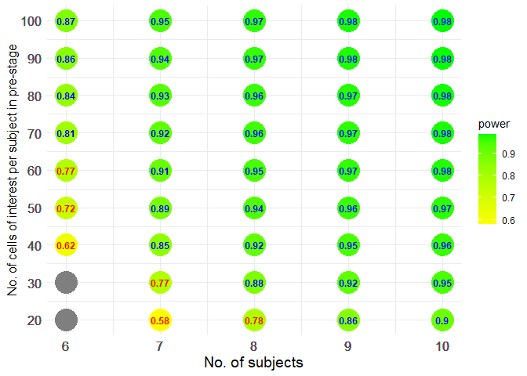
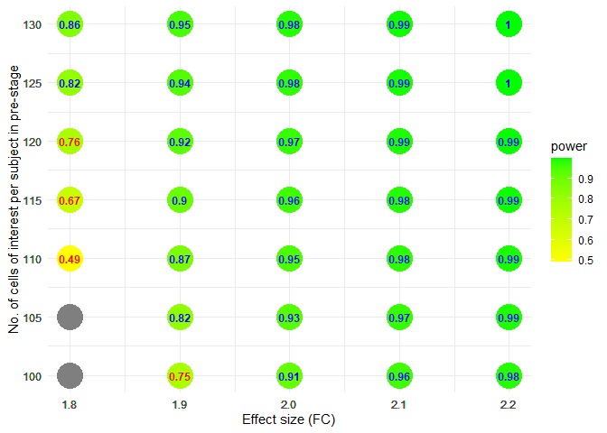
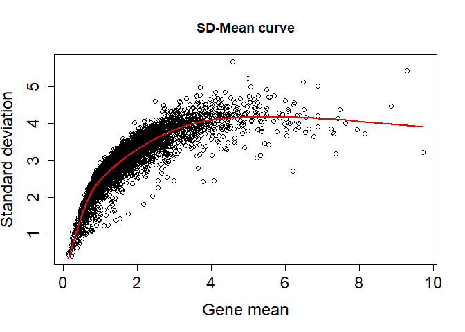
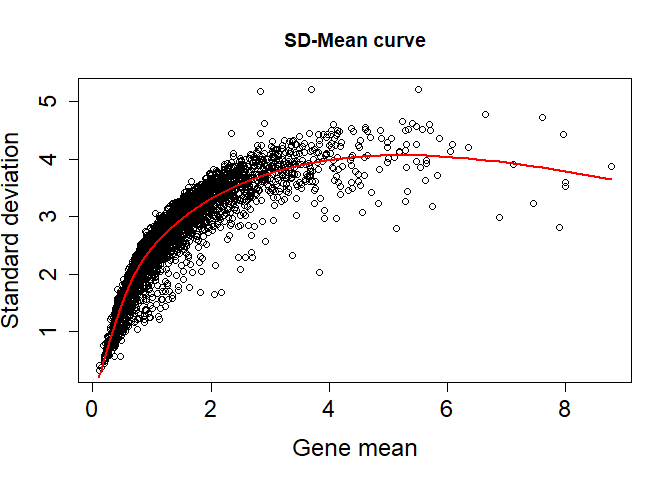
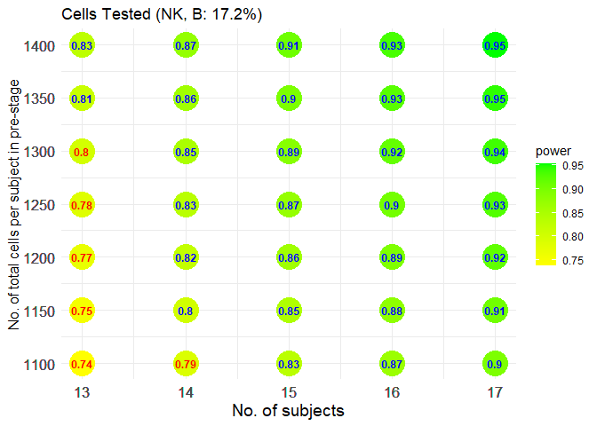
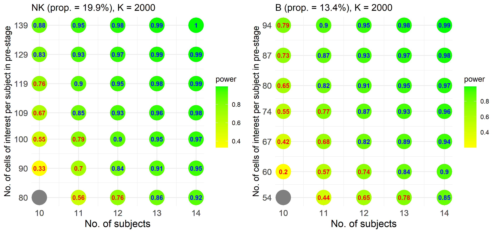

Comparison between pre- and post-treatment groups
================

``` r
library(scPS)
library(ggplot2)
```

- Example 1. With a fixed fold change (effect size)
- Example 2. With a fixed sample size
- Example 3. With a pilot data

### Example 1

#### A simulated information

``` r
set.seed(12345)
# means of 1000 candidate genes in pre-treatment
vvmean1 <- rgamma(1000, shape=2, scale=0.5)

# 2-fold change (post-treatment to pre-treatment) in 5% DEGs
FC <- c(rep(2, 50), rep(1, 950))

# cell-cell correlations for 1000 candidate genes within subject
vvrho <- runif(1000, 0, 0.2) 

# Relationship between gene standard deviations and gene means
# hf <- function(x) sqrt(a*x), a>1 denotes overdispersion
hf <- function(x) sqrt(x)
```

#### Powers at different sample sizes and cell numbers per sample

At FDR = 0.05, expected power = 0.8 (marked in blue), 1:1 (r = 1) equal
cell numbers at pre- and post-treatment groups.

``` r
view.size <- sizeCal.BA(low.up.m=c(6,10), low.up.n=c(20,100), ePower=0.8, FDR=0.05,
            grid.m=1, grid.n=10, r=1, vvmean1, FC, vvrho, hf)
view.size$fig
```

<!-- -->

Gray points denote FDR cannot be controlled.

### Example 2

#### A hypothesized information

``` r
# means of 2000 candidate genes in control
mean.control <- rep(1, 2000)

# 1% DEGs
n.DEG <- length(mean.control)*0.01

# cell-cell correlations for 2000 candidate genes within subject
icc <- rep(0.01, length(mean.control))

# Relationship between gene standard deviations and gene means
hf <- function(x) sqrt(2*x)
```

#### Powers at a fixed sample size but with different levels of FC

At FDR = 0.05, expected power = 0.8 (marked in blue), 1:1 (r = 1) equal
cell numbers at pre- and post-treatment groups.

``` r
# Set different FC, 1.7, 1.8, ..., 2.1
# Fix 7 subjects (total) 
esizes <- seq(1.7, 2.1, 0.1)
list3 <- lapply(esizes, function(x) {
  FC <- c(rep(x, n.DEG), rep(1, length(mean.control) - n.DEG))
  size.view <- sizeCal.BA(low.up.m=c(7,7), low.up.n=c(100,150), ePower=0.8, FDR=0.05,
                        grid.m=1, grid.n=5, r=1,
                        vvmean1=mean.control, FC=FC, vvrho=icc, hf=hf)
  cbind(x=x, size.view$m.n.power)
})
dat2 <- do.call(rbind, list3); ePower <- 0.8
```

``` r
fig <- ggplot(dat2, aes(x=x, y=n, fill=power)) +
  geom_point(size=10, shape=21, colour = "transparent") +
  geom_text(aes(label = round(power, 2), color = ifelse(power > ePower, "blue", "red")),
            size = 3.2, show.legend = FALSE) +
  scale_color_manual(values = c("blue", "red")) +
  scale_fill_gradient(low = "yellow", high = "green") +
  scale_x_continuous(breaks = dat2$x) +
  scale_y_continuous(breaks = dat2$n) +
  xlab("Effect size (FC)") +
  ylab("No. of cells of interest per subject in pre-stage") +
  theme_minimal()
fig
```

<!-- -->

### Example 3

#### A pilot data that has been normalized by relative counts

``` r
counts <- GSE120575n$counts
cell.info <- GSE120575n$cell.info
cell.info$TX <- factor(cell.info$TX, levels = c("Pre", "Post"))
```

#### Estimate required parameters from NK and B cells of interest

Take 1 ~ 2 minutes

``` r
geneObject <- estPreParas.multi(counts, cell.info, id="ptID", x1="TX",
                     cells.interesting=c("NK", "B"))
```

    ## [1] "Pre- and post-treatment comparison"

#### Select 2000 candidate genes for each cell type (NK and B cells)

Take 1 ~ 2 minutes. 2000 candidate genes are selected according to the
smallest unadjusted p-values.

``` r
Genes.tested <- geneCandidate(geneObject)
```

    ## [1] "Pre- and post-treatment comparison"

<!-- -->

    ## [1] "Warning: id P28 are excluded from calculation because empty in pre- or post-satge"

<!-- -->

    ## [1] "Warning: id P1, P12, P28, P3 are excluded from calculation because empty in pre- or post-satge"

#### Total powers to detect the DEGs in the two cell types of interest

``` r
view.size <- sizeCal.multi.BA(low.up.m=c(13,17), low.up.n=c(1100,1400),
     ePower=0.8, FDR=0.05, grid.m=1, grid.n=50, r=1, Genes.tested)
view.size$fig
```

<!-- -->

#### Separate powers for each cell type of interest

``` r
plotPower.sep(view.size)
```

<!-- -->
