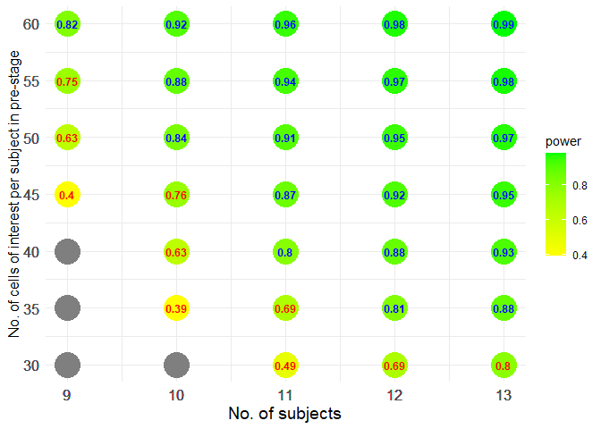
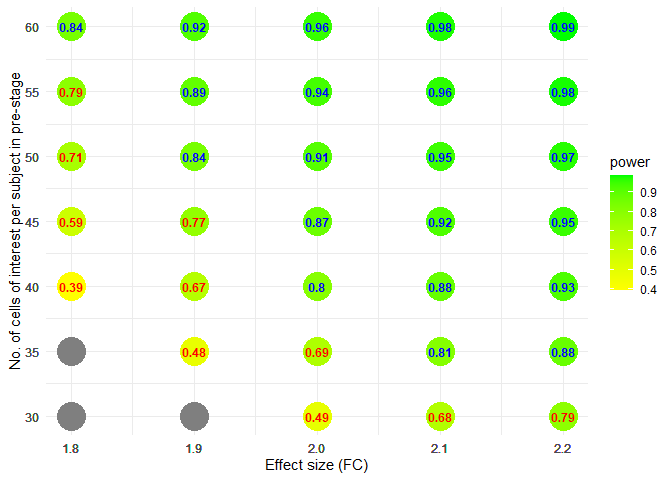
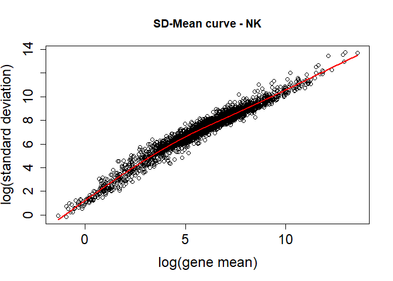
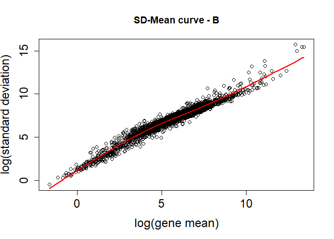
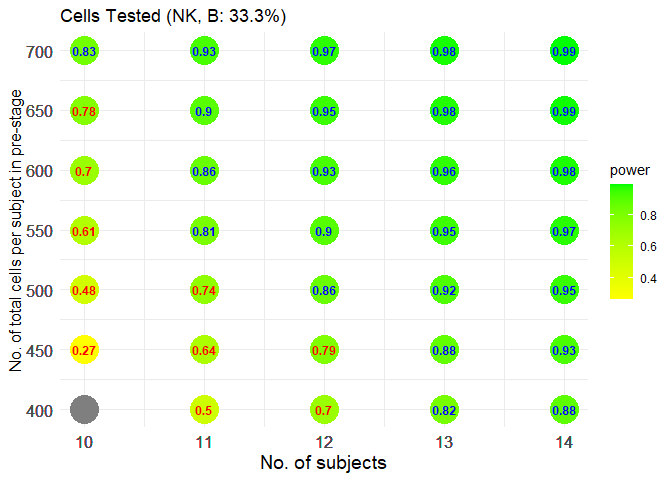
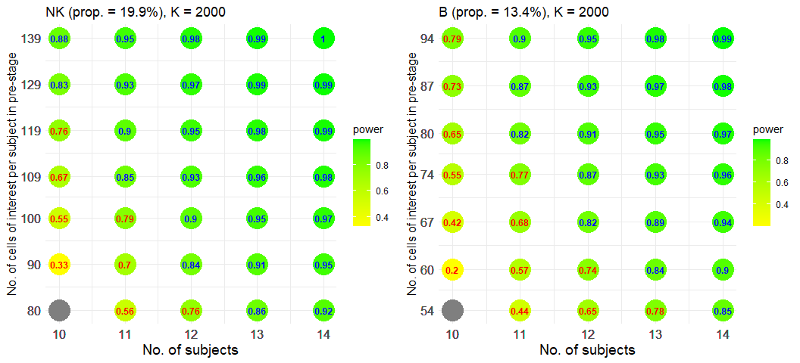
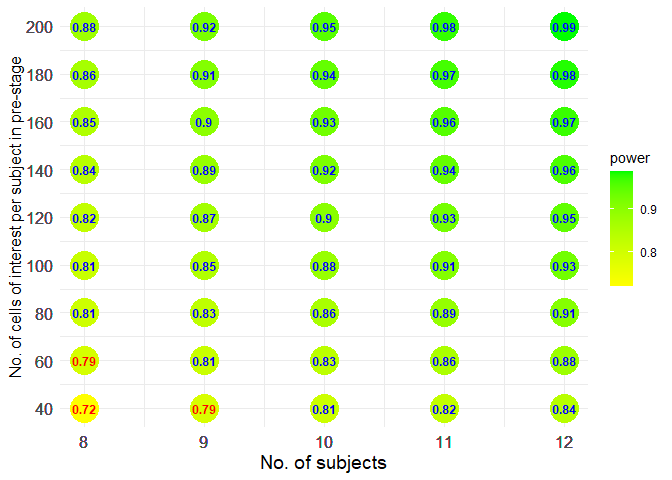
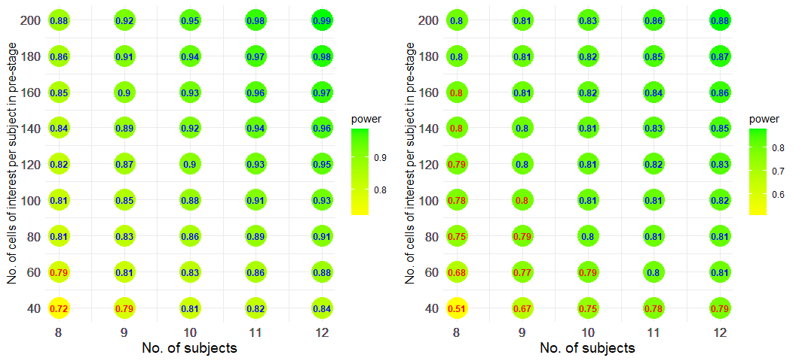
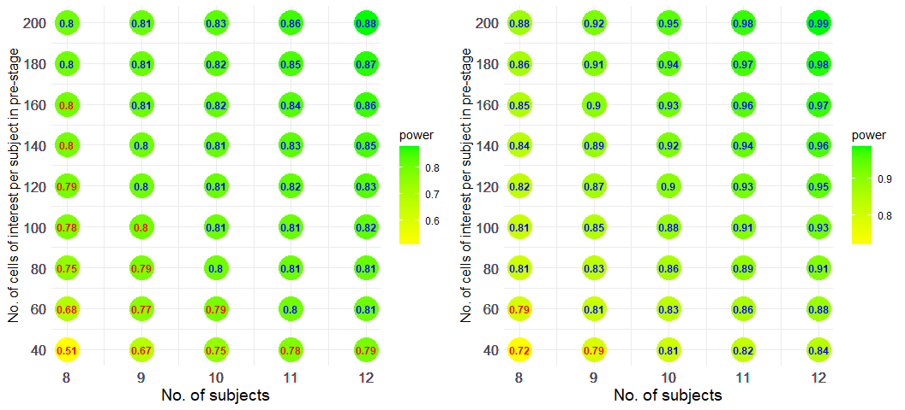
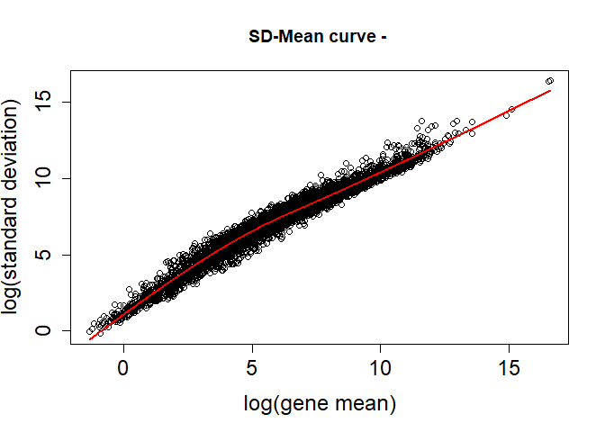

Paired-group Comparison
================

``` r
library(scPS)
library(ggplot2)
library(ggpubr)
library(splines)
```

- [Example
  1](#Example-1-Powers-at-different-sample-sizes-and-cell-numbers-under-a-fixed-fold-change).
  Powers at different sample sizes and cell numbers under a fixed fold
  change
- [Example
  2](#Example-2-Powers-at-different-fold-changes-and-cell-numbers-under-a-fixed-sample-size).
  Powers at different fold changes and cell numbers under a fixed sample
  size
- [Example
  3](#Example-3-Power-and-sample-size-calculation-with-a-pilot-data-from-a-GSE120575-subdata).
  Power and sample size calculation with a pilot data from a GSE120575
  subdata
- [Example
  4](#Example-4-An-optimal-combination-of-sample-sizes-and-cell-numbers-given-a-cost-function).
  An optimal combination of sample sizes and cell numbers, given a cost
  function
- [Example
  5](#Example-5-Impact-of-cells-ratios-between-groups-on-powers). Impact
  of cells ratios between groups on powers
- [Example 6](#Example-6-Impact-of-gene-expression-levels-on-powers).
  Impact of gene expression levels on powers
- [Example 7](#Hypothesis-testing). Hypothesis testing

### Example 1. Powers at different sample sizes and cell numbers under a fixed fold change

#### Parameters setting, without pilot data

``` r
set.seed(12345)
# Provide gene means for 1000 candidate genes in control
# Gene means can be fitted with a gamma distribution, 
# according to real data. The shape and scale parameters in gamma can be
# calculated by gammaTrans when given the mean and the 0.95 quantile of gene means.
abm <- gammaTrans(mean=1, q95=2.5)
vvmean1 <- rgamma(1000, shape=abm[1], scale=abm[2])

# 2-fold change (post-treatment to pre-treatment) in 5% DEGs
FC <- c(rep(2, 50), rep(1, 950))

# Provide cell-cell correlations for 1000 candidate genes within subject
# Correlations can be fitted well with a gamma distribution, 
# according to real data. The shape and scale parameters in gamma can be
# calculated by gammaTrans when given the mean and the 0.95 quantile of ICCs.
ab <- gammaTrans(mean=0.01, q95=0.1) # Output the shape and scale parameters.
vvrho <- rgamma(1000, shape=ab[1], scale=ab[2])

# Relationship between gene standard deviations and gene means
# hf <- function(x) sqrt(x*(1+a*x)), a>1 denotes overdispersion
hf <- function(x) sqrt(x*(1+3*x))
```

#### Powers at different sample sizes and cell numbers

FDR = 0.05, expected power = 0.8 (marked in blue), 1:1 (rc = 1) cells
ratio (a ratio of cell numbers in pre-treatment group to those in
post-treatment group).

``` r
view.size <- sizeCal.BA(low.up.m=c(9,13), low.up.n=c(30,60), ePower=0.8, FDR=0.05,
                        grid.m=1, grid.n=5, rc=1, vvmean1, FC, vvrho, hf)
view.size$fig
```

<!-- -->

Gray points denote FDR cannot be controlled under a given level.

### Example 2. Powers at different fold changes and cell numbers under a fixed sample size

We use the same parameters setting as above and consider 11 subjects.

``` r
# Set different FC, 1.8, 1.9, ..., 2.2
# Fix 11 subjects (total) 
esizes <- seq(1.8, 2.2, 0.1)
list3 <- lapply(esizes, function(x) {
  FC <- c(rep(x, 50), rep(1, 950))
  size.view <- sizeCal.BA(low.up.m=c(11,11), low.up.n=c(30,60), ePower=0.8, FDR=0.05,
                        grid.m=1, grid.n=5, rc=1,
                        vvmean1=vvmean1, FC=FC, vvrho=vvrho, hf=hf)
  cbind(x=x, size.view$m.n.power)
})
dat2 <- do.call(rbind, list3); ePower <- 0.8
```

``` r
fig <- ggplot(dat2, aes(x=x, y=n, fill=power)) +
  geom_point(size=10, shape=21, colour = "transparent") +
  geom_text(aes(label = round(power, 2), color = ifelse(power > ePower, "blue", "red"), fontface=2),
            size = 3.2, show.legend = FALSE) +
  scale_color_manual(values = c("blue", "red")) +
  scale_fill_gradient(low = "yellow", high = "green") +
  scale_x_continuous(breaks = dat2$x) +
  scale_y_continuous(breaks = dat2$n) +
  xlab("Effect size (FC)") +
  ylab("No. of cells of interest per subject in pre-stage") +
  theme_minimal()
fig
```

<!-- -->

Gray points denote FDR cannot be controlled under a given level.

### Example 3. Power and sample size calculation with a pilot data from a GSE120575 subdata

#### Load a pilot data that has been normalized by relative counts

``` r
load(file = "DataForDemo/GSE120575n.rda")
counts <- GSE120575n$counts
cell.info <- GSE120575n$cell.info
cell.info$TX <- factor(cell.info$TX, levels = c("Pre", "Post"))
```

#### Estimate required parameters from NK and B cells of interest

It takes 1 ~ 2 minutes.

``` r
geneObject <- estPreParas.multi(counts, cell.info, 
                                id="ptID", x1="TX", cellcluster="cellcluster",
                                cells.interesting=c("NK", "B"))
```

    ## [1] "Paired groups"

#### Select 2000 candidate genes for each cell type (NK and B cells)

It takes 1 ~ 2 minutes. For each cell type, 2000 genes with large
observed fold-changes are selected as candidate genes of interest and
the top 1% genes with the smallest unadjusted p-values among the
candidate genes are considered as DEGs.

``` r
Genes.tested <- geneCandidate(geneObject)
```

    ## [1] "Paired-group comparison"

<!-- -->

    ## [1] "Warning: id P28 are excluded from calculation because empty in one of paired groups"

<!-- -->

    ## [1] "Warning: id P1, P12, P28, P3 are excluded from calculation because empty in one of paired groups"

#### Total powers to detect the DEGs in the two cell types

``` r
view.size <- sizeCal.multi.BA(low.up.m=c(10,14), low.up.n=c(400,700),
                              ePower=0.8, FDR=0.05, grid.m=1, grid.n=50, rc=1, Genes.tested)
view.size$fig
```

<!-- -->

#### Separate powers for each cell type

``` r
plotPower.sep(view.size)
```

<!-- -->

### Example 4. An optimal combination of sample sizes and cell numbers, given a cost function

We use the same scenario setting as used in Result section of our paper
(paired-group comparison). It can duplicate the result of Figure 3(b).
Next we employ the function “optimalCost” to select an optimal
combination.

``` r
load(file = "DataForDemo/Result_NB_paired.RData")

mean1 <- Result_NB_paired$mean1
FC <- Result_NB_paired$FC
icc <- Result_NB_paired$icc

eta <- Result_NB_paired$eta
hf <- function(uu) {
  xx <- log(uu)
  exp(predict(eta, data.frame(xx=xx)))
}

size.view <- sizeCal.BA(low.up.m=c(8,12), low.up.n=c(40,200), ePower=0.8, FDR=0.05,
                        grid.m=1, grid.n=20, rc=1,
                        vvmean1=mean1, FC=FC, vvrho=icc, hf=hf)
size.view$fig
```

<!-- -->

#### Top 10 combinations of sample sizes and cell numbers, minimizing costs while achieving a power of 0.8, given a cost function of $C(m,n)=m\times n\times cost.per.cell$.

``` r
cost.per.cell <- 0.24 #Overall cost per cell $0.24 (20,000 reads/cell) https://satijalab.org/costpercell
prop.this.cell <- 0.035 #Assume this cell type of interest constitutes 3.5% of the total cell population
costfun1 <- function(m,n) m*n*cost.per.cell
head(optimalCost(size.view, costfun=costfun1, ePower=0.8, budget = NULL, prop.this.cell), 10)
```

    ##    Rank      cost  m n1 n2     power
    ## 3     1  5485.714 10 40 40 0.8068622
    ## 4     2  6034.286 11 40 40 0.8214601
    ## 5     3  6582.857 12 40 40 0.8378015
    ## 7     4  7405.714  9 60 60 0.8111048
    ## 8     5  8228.571 10 60 60 0.8321902
    ## 11    6  8777.143  8 80 80 0.8053709
    ## 9     7  9051.429 11 60 60 0.8570414
    ## 10    8  9874.286 12 60 60 0.8790742
    ## 12    9  9874.286  9 80 80 0.8285724
    ## 13   10 10971.429 10 80 80 0.8606962
Note that n1 and n2 are the number of cells of interest. Total cells per sample are (n1+n2)/0.035.

#### Top 10 combinations of sample sizes and cell numbers, maximizing powers within a given budget of 20000, given a cost function of $C(m,n)=m\times n\times cost.per.cell$.

``` r
head(optimalCost(size.view, costfun=costfun1, ePower=0.8, budget = 20000, prop.this.cell), 10)
```

    ##    Rank     cost  m  n1  n2     power
    ## 25    1 19748.57 12 120 120 0.9461133
    ## 20    2 16457.14 12 100 100 0.9282310
    ## 24    3 18102.86 11 120 120 0.9260999
    ## 28    4 19200.00 10 140 140 0.9168249
    ## 19    5 15085.71 11 100 100 0.9090044
    ## 15    6 13165.71 12  80  80 0.9074532
    ## 23    7 16457.14 10 120 120 0.9024179
    ## 32    8 19748.57  9 160 160 0.8989488
    ## 14    9 12068.57 11  80  80 0.8875740
    ## 27   10 17280.00  9 140 140 0.8859078
Note that n1 and n2 are the number of cells of interest. Total cells per sample are (n1+n2)/0.035.

### Example 5. Impact of cells ratios between groups on powers

With 13 subjects per group and a fixed total of cells, the powers at
cells ratios of 5:1, 2:1, 1:1, 1:2, and 1:5 between groups are:

``` r
pm51 <- powerCal.BA(ns=c(5,1)*20, m=9, vvmean1=mean1, FC=FC, vvrho=icc, hf=hf, FDR=0.05)
pm21 <- powerCal.BA(ns=c(4,2)*20, m=9, vvmean1=mean1, FC=FC, vvrho=icc, hf=hf, FDR=0.05)
pm11 <- powerCal.BA(ns=c(3,3)*20, m=9, vvmean1=mean1, FC=FC, vvrho=icc, hf=hf, FDR=0.05)
pm12 <- powerCal.BA(ns=c(2,4)*20, m=9, vvmean1=mean1, FC=FC, vvrho=icc, hf=hf, FDR=0.05)
pm15 <- powerCal.BA(ns=c(1,5)*20, m=9, vvmean1=mean1, FC=FC, vvrho=icc, hf=hf, FDR=0.05)
c(pm51[1], pm21[1], pm11[1], pm12[1], pm15[1])
```

    ##     power     power     power     power     power 
    ## 0.7361495 0.8086601 0.8111048 0.8043179 0.7815392

A 1:1 cells ratio achieves a larger power under a same total of cells.

### Example 6. Impact of gene expression levels on powers

We use the parameters setting in Example 1 and consider 3 gene
expression levels.

``` r
set.seed(12345)
abm <- gammaTrans(mean=1, q95=2.5)
vvmean1 <- rgamma(1000, shape=abm[1], scale=abm[2])
FC <- c(rep(2, 50), rep(1, 950))
ab <- gammaTrans(mean=0.01, q95=0.1)
vvrho <- rgamma(1000, shape=ab[1], scale=ab[2])
hf <- function(x) sqrt(x*(1+3*x))

vvmean1_L4 <- vvmean1/4 # Very low gene expression level
vvmean1_L2 <- vvmean1/2 # Low gene expression level
vvmean1_N  <- vvmean1   # Normal gene expression level
```

``` r
view.size_L4 <- sizeCal.BA(low.up.m=c(9,13), low.up.n=c(30,60), ePower=0.8, FDR=0.05,
                           grid.m=1, grid.n=5, rc=1, vvmean1_L4, FC, vvrho, hf)
view.size_L2 <- sizeCal.BA(low.up.m=c(9,13), low.up.n=c(30,60), ePower=0.8, FDR=0.05,
                           grid.m=1, grid.n=5, rc=1, vvmean1_L2, FC, vvrho, hf)
view.size_N  <- sizeCal.BA(low.up.m=c(9,13), low.up.n=c(30,60), ePower=0.8, FDR=0.05,
                           grid.m=1, grid.n=5, rc=1, vvmean1_N, FC, vvrho, hf)

ggarrange(plotlist=list(view.size_L4$fig, view.size_L2$fig, view.size_N$fig), nrow = 1,  ncol = 3)
```

<!-- --> More samples are
required to achieve a certain power as expression levels decrease, with
other factors held constant.

We use the same scenario setting as used in Result section of our paper
(paired-group comparison) but divide the mean expression values of genes
by 2 to generate data with lowly expressed genes. We compare the
performance of powers between data with regular/normal expression level
and data with low expression level.

``` r
load(file = "DataForDemo/Result_NB_paired_low.RData")

mean1 <- Result_NB_paired$mean1
FC <- Result_NB_paired$FC
icc <- Result_NB_paired$icc

eta <- Result_NB_paired$eta
hf <- function(uu) {
  xx <- log(uu)
  exp(predict(eta, data.frame(xx=xx)))
}

size.view2 <- sizeCal.BA(low.up.m=c(8,12), low.up.n=c(40,200), ePower=0.8, FDR=0.05,
                         grid.m=1, grid.n=20, rc=1,
                         vvmean1=mean1, FC=FC, vvrho=icc, hf=hf)
```

``` r
ggarrange(plotlist=list(size.view2$fig, size.view$fig), nrow = 1,  ncol = 2)
```

<!-- --> Powers with lowly
expressed data (left figure) are lower than those with regularly
expressed data (right figure). More samples will be required to achieve
a power of 0.8.

### Example 7. Hypothesis testing

We perform differential expression analysis on NK cells in the GSE120575
subdata from Example 3.

``` r
## Select NK cells
cells.interesting <- which(cell.info$cellcluster=="NK")
counts.small <- counts[,cells.interesting]
cell.info.small <- data.frame(id=cell.info[cells.interesting, "ptID"],
        x1=ifelse(cell.info[cells.interesting, "TX"]=="Pre", 0, 1) )

## Select genes that will be tested
aa <- estPreParas(counts=counts.small, cell.info=cell.info.small)
idx.selected <- with(aa, which(nonZeroPs1>0.1 & nonZeroPs2>0.1))
aaP <- aa[idx.selected,]
curve.view <- fitSdmean(preParas=aaP, sp.method = "ns")
```

<!-- -->

``` r
hf <- curve.view$hf.sigma

## Test the selected genes
counts.test <- counts.small[idx.selected,]
geeout <- geeDEA.BA(counts.test, cell.info=cell.info.small, hf=hf, BCC=1)
```

    ## [1] "Warning: id P28 are excluded from calculation because empty in one of paired groups"

``` r
head(geeout)
```

    ##              logFC     unadj.p           icc   est.mu1   est.mu2   raw.mu1
    ## DPM1    -0.4737616 0.117752469  0.0009488892 1177.9751  733.4729 1183.4584
    ## FGR     -0.3525102 0.311758764  0.0195510637 2632.3691 1850.3485 2681.7459
    ## FUCA2   -1.2466200 0.002401416 -0.0009597243  562.4773  161.6981  566.7829
    ## NIPAL3   0.9151335 0.031869984 -0.0022477941  154.4879  385.7730  155.1410
    ## ANKIB1  -1.1000887 0.078768364  0.0166720079 1148.1675  382.1578 1228.4814
    ## CYP51A1 -0.4885694 0.166874939  0.0005350109  290.3967  178.1594  292.1224
    ##          raw.mu2
    ## DPM1    726.1326
    ## FGR     943.0032
    ## FUCA2   160.2400
    ## NIPAL3  379.3108
    ## ANKIB1  329.5073
    ## CYP51A1 177.0832

