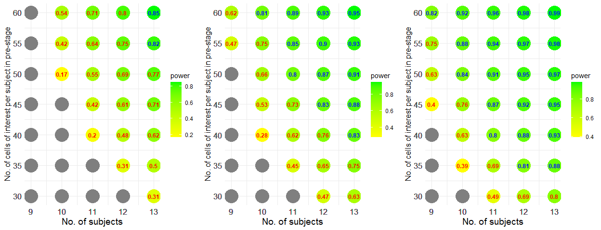

Paired-group Comparison
================

``` r
library(scPS)
library(ggplot2)
library(ggpubr)
library(splines)
```

- [Example 1](#Example-1-Powers-at-different-sample-sizes-and-cell-numbers-under-a-fixed-fold-change). Powers at different sample sizes and cell numbers under a
  fixed fold change
- [Example 2](#Example-2-Powers-at-different-fold-changes-and-cell-numbers-under-a-fixed-sample-size). Powers at different fold changes and cell numbers under a
  fixed sample size
- [Example 3](#Example-3-Power-and-sample-size-calculation-with-a-pilot-data-from-a-GSE120575-subdata). Power and sample size calculation with a pilot data from a
  GSE120575 subdata
- [Example 4](#Example-4-An-optimal-combination-of-sample-sizes-and-cell-numbers-given-a-cost-function). An optimal combination of sample sizes and cell numbers,
  given a cost function
- [Example 5](#Example-5-Impact-of-cells-ratios-between-groups-on-powers). Impact of cells ratios between groups on powers
- [Example 6](#Example-6-Impact-of-gene-expression-levels-on-powers). Impact of gene expression levels on powers

### Example 1. Powers at different sample sizes and cell numbers under a fixed fold change

#### Parameters setting, without pilot data

``` r
set.seed(12345)
# Provide gene means for 1000 candidate genes in control
# Gene means can be fitted with a gamma distribution, 
# according to real data. The shape and scale parameters in gamma can be
# calculated by gammaTrans when given the mean and the 0.95 quantile of gene means.
abm <- gammaTrans(mean=1, q95=2.5)
vvmean1 <- rgamma(1000, shape=abm[1], scale=abm[2])

# 2-fold change (post-treatment to pre-treatment) in 5% DEGs
FC <- c(rep(2, 50), rep(1, 950))

# Provide cell-cell correlations for 1000 candidate genes within subject
# Correlations can be fitted well with a gamma distribution, 
# according to real data. The shape and scale parameters in gamma can be
# calculated by gammaTrans when given the mean and the 0.95 quantile of ICCs.
ab <- gammaTrans(mean=0.01, q95=0.1) # Output the shape and scale parameters.
vvrho <- rgamma(1000, shape=ab[1], scale=ab[2])

# Relationship between gene standard deviations and gene means
# hf <- function(x) sqrt(x*(1+a*x)), a>1 denotes overdispersion
hf <- function(x) sqrt(x*(1+3*x))
```

#### Powers at different sample sizes and cell numbers

FDR = 0.05, expected power = 0.8 (marked in blue), 1:1 (rc = 1) cells
ratio (a ratio of cell numbers in post-treatment group to those in
pre-treatment group).

``` r
view.size <- sizeCal.BA(low.up.m=c(9,13), low.up.n=c(30,60), ePower=0.8, FDR=0.05,
                        grid.m=1, grid.n=5, rc=1, vvmean1, FC, vvrho, hf)
view.size$fig
```

<!-- -->

Gray points denote FDR cannot be controlled under a given level.

### Example 2. Powers at different fold changes and cell numbers under a fixed sample size

We use the same parameters setting as above and consider 11 subjects.

``` r
# Set different FC, 1.8, 1.9, ..., 2.2
# Fix 11 subjects (total) 
esizes <- seq(1.8, 2.2, 0.1)
list3 <- lapply(esizes, function(x) {
  FC <- c(rep(x, 50), rep(1, 950))
  size.view <- sizeCal.BA(low.up.m=c(11,11), low.up.n=c(30,60), ePower=0.8, FDR=0.05,
                        grid.m=1, grid.n=5, rc=1,
                        vvmean1=vvmean1, FC=FC, vvrho=vvrho, hf=hf)
  cbind(x=x, size.view$m.n.power)
})
dat2 <- do.call(rbind, list3); ePower <- 0.8
```

``` r
fig <- ggplot(dat2, aes(x=x, y=n, fill=power)) +
  geom_point(size=10, shape=21, colour = "transparent") +
  geom_text(aes(label = round(power, 2), color = ifelse(power > ePower, "blue", "red"), fontface=2),
            size = 3.2, show.legend = FALSE) +
  scale_color_manual(values = c("blue", "red")) +
  scale_fill_gradient(low = "yellow", high = "green") +
  scale_x_continuous(breaks = dat2$x) +
  scale_y_continuous(breaks = dat2$n) +
  xlab("Effect size (FC)") +
  ylab("No. of cells of interest per subject in pre-stage") +
  theme_minimal()
fig
```

<!-- -->

Gray points denote FDR cannot be controlled under a given level.

### Example 3. Power and sample size calculation with a pilot data from a GSE120575 subdata

#### Load a pilot data that has been normalized by relative counts

``` r
load(file = "DataForDemo/GSE120575n.rda")
counts <- GSE120575n$counts
cell.info <- GSE120575n$cell.info
cell.info$TX <- factor(cell.info$TX, levels = c("Pre", "Post"))
```

#### Estimate required parameters from NK and B cells of interest

It takes 1 ~ 2 minutes.

``` r
geneObject <- estPreParas.multi(counts, cell.info, 
                                id="ptID", x1="TX", cellcluster="cellcluster",
                                cells.interesting=c("NK", "B"))
```

    ## [1] "Paired groups"

#### Select 2000 candidate genes for each cell type (NK and B cells)

It takes 1 ~ 2 minutes. For each cell type, 2000 genes with large
observed fold-changes are selected as candidate genes of interest and
the top 1% genes with the smallest unadjusted p-values among the
candidate genes are considered as DEGs.

``` r
Genes.tested <- geneCandidate(geneObject)
```

    ## [1] "Paired-group comparison"

<!-- -->

    ## [1] "Warning: id P28 are excluded from calculation because empty in one of paired groups"

<!-- -->

    ## [1] "Warning: id P1, P12, P28, P3 are excluded from calculation because empty in one of paired groups"

#### Total powers to detect the DEGs in the two cell types

``` r
view.size <- sizeCal.multi.BA(low.up.m=c(10,14), low.up.n=c(400,700),
     ePower=0.8, FDR=0.05, grid.m=1, grid.n=50, rc=1, Genes.tested)
view.size$fig
```

<!-- -->

#### Separate powers for each cell type

``` r
plotPower.sep(view.size)
```

<!-- -->

### Example 4. An optimal combination of sample sizes and cell numbers, given a cost function

We use the same scenario setting as used in Result section of our paper
(paired-group comparison). It can duplicate the result of Figure 3(b).
Next we employ the function “optimalCost” to select an optimal
combination.

``` r
load(file = "DataForDemo/Result_NB_paired.RData")

mean1 <- Result_NB_paired$mean1
FC <- Result_NB_paired$FC
icc <- Result_NB_paired$icc

eta <- Result_NB_paired$eta
hf <- function(uu) {
  xx <- log(uu)
  exp(predict(eta, data.frame(xx=xx)))
}

size.view <- sizeCal.BA(low.up.m=c(8,12), low.up.n=c(40,200), ePower=0.8, FDR=0.05,
                        grid.m=1, grid.n=20, rc=1,
                        vvmean1=mean1, FC=FC, vvrho=icc, hf=hf)
size.view$fig
```

<!-- -->

#### Top 10 combinations of sample sizes and cell numbers, minimizing costs while achieving a power of 0.8, given a cost function of $C(m,n)=mn$

``` r
head(optimalCost(size.view, costfun=function(m, n) m*n, ePower=0.8, budget = NULL), 10)
```

    ##    Rank cost  m n1 n2     power
    ## 3     1  800 10 40 40 0.8068622
    ## 4     2  880 11 40 40 0.8214601
    ## 5     3  960 12 40 40 0.8378015
    ## 7     4 1080  9 60 60 0.8111048
    ## 8     5 1200 10 60 60 0.8321902
    ## 11    6 1280  8 80 80 0.8053709
    ## 9     7 1320 11 60 60 0.8570414
    ## 10    8 1440 12 60 60 0.8790742
    ## 12    9 1440  9 80 80 0.8285724
    ## 13   10 1600 10 80 80 0.8606962

#### Top 10 combinations of sample sizes and cell numbers, maximizing powers under a given budget of 2000, given a cost function of $C(m,n)=mn$

``` r
head(optimalCost(size.view, costfun=function(m, n) m*n, ePower=0.8, budget = 2000), 10)
```

    ##    Rank cost  m  n1  n2     power
    ## 15    1 1920 12  80  80 0.9074532
    ## 14    2 1760 11  80  80 0.8875740
    ## 18    3 2000 10 100 100 0.8846285
    ## 10    4 1440 12  60  60 0.8790742
    ## 13    5 1600 10  80  80 0.8606962
    ## 9     6 1320 11  60  60 0.8570414
    ## 17    7 1800  9 100 100 0.8495938
    ## 5     8  960 12  40  40 0.8378015
    ## 8     9 1200 10  60  60 0.8321902
    ## 12   10 1440  9  80  80 0.8285724

### Example 5. Impact of cells ratios between groups on powers

With 13 subjects per group and a fixed total of cells, the powers at
cells ratios of 5:1, 2:1, 1:1, 1:2, and 1:5 between groups are:

``` r
pm51 <- powerCal.BA(ns=c(5,1)*20, m=9, vvmean1=mean1, FC=FC, vvrho=icc, hf=hf, FDR=0.05)
pm21 <- powerCal.BA(ns=c(4,2)*20, m=9, vvmean1=mean1, FC=FC, vvrho=icc, hf=hf, FDR=0.05)
pm11 <- powerCal.BA(ns=c(3,3)*20, m=9, vvmean1=mean1, FC=FC, vvrho=icc, hf=hf, FDR=0.05)
pm12 <- powerCal.BA(ns=c(2,4)*20, m=9, vvmean1=mean1, FC=FC, vvrho=icc, hf=hf, FDR=0.05)
pm15 <- powerCal.BA(ns=c(1,5)*20, m=9, vvmean1=mean1, FC=FC, vvrho=icc, hf=hf, FDR=0.05)
c(pm51[1], pm21[1], pm11[1], pm12[1], pm15[1])
```

    ##     power     power     power     power     power 
    ## 0.7361495 0.8086601 0.8111048 0.8043179 0.7815392

A 1:1 cells ratio achieves a larger power under a same total of cells.

### Example 6. Impact of gene expression levels on powers

We use the same scenario setting as used in Result section of our paper
(paired-group comparison) but divide the mean expression values of genes
by 2 to generate data with lowly expressed genes. We compare the
performance of powers between data with regular/normal expression level
and data with low expression level.

``` r
load(file = "DataForDemo/Result_NB_paired_low.RData")

mean1 <- Result_NB_paired$mean1
FC <- Result_NB_paired$FC
icc <- Result_NB_paired$icc

eta <- Result_NB_paired$eta
hf <- function(uu) {
  xx <- log(uu)
  exp(predict(eta, data.frame(xx=xx)))
}

size.view2 <- sizeCal.BA(low.up.m=c(8,12), low.up.n=c(40,200), ePower=0.8, FDR=0.05,
                         grid.m=1, grid.n=20, rc=1,
                         vvmean1=mean1, FC=FC, vvrho=icc, hf=hf)
```

``` r
ggarrange(plotlist=list(size.view2$fig, size.view$fig), nrow = 1,  ncol = 2)
```

<!-- --> Powers with lowly
expressed data (left figure) are lower than those with regularly
expressed data (right figure). More samples will be required to achieve
a power of 0.8.
